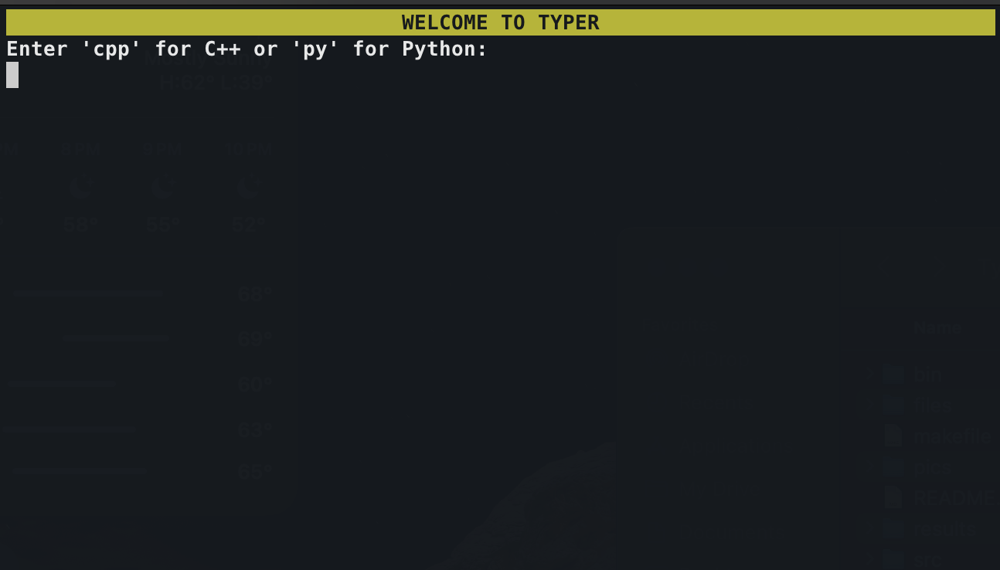
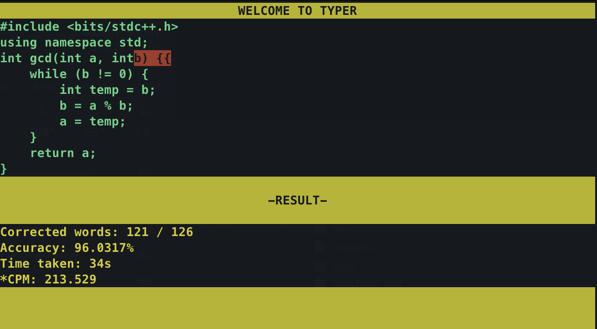

Typer executable is currently only supported for Unix-based systems. If you are a windows user, please use "make cpp" to practice with C++, or "make py" to practice with Python.

Built with C++ 17.

# Typer for Programmers

For programmers, typing programs fast enough makes you an edge advantage in everywhere. You may think I am talking all about the speed. No. Programming requires logics, and if you have to think what you are typing, it slows you down and you are likely to make more errors. Thus, I looked online if there are any website that I can practise these typing for programming. Unfortunately, I only found some lengthy and boring enough programs that I don't type them daily. So, I build this "Typer" where everyone can practise some data structures code and improve!
This is designd to help you practice and improve your typing speed, especially for those technical interviews or competitive programming. Focusing on data structure topics, so you'll not only get faster at typing in your chosen programming language, but you'll also build up an automatic memory for typing out popular data structures. Sounds Cool enough?

At the end of each game, you'll get a summary of your typing speed, measured in characters per minute (WPM is not relevant in programming since programs are usually not like novels)

Right now, this game only supports C++ and Python, but if you want, you're more than welcome to add more data structures to the "files/" directory with your desired language.

